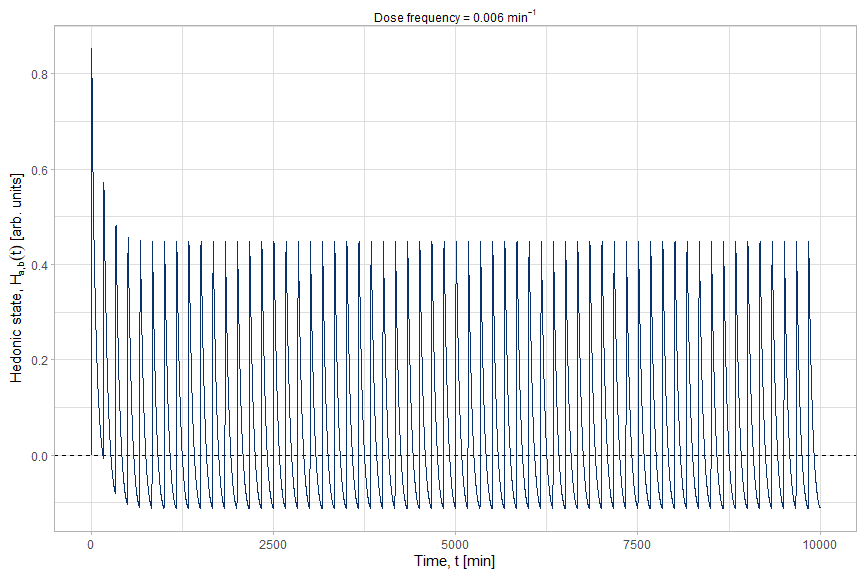
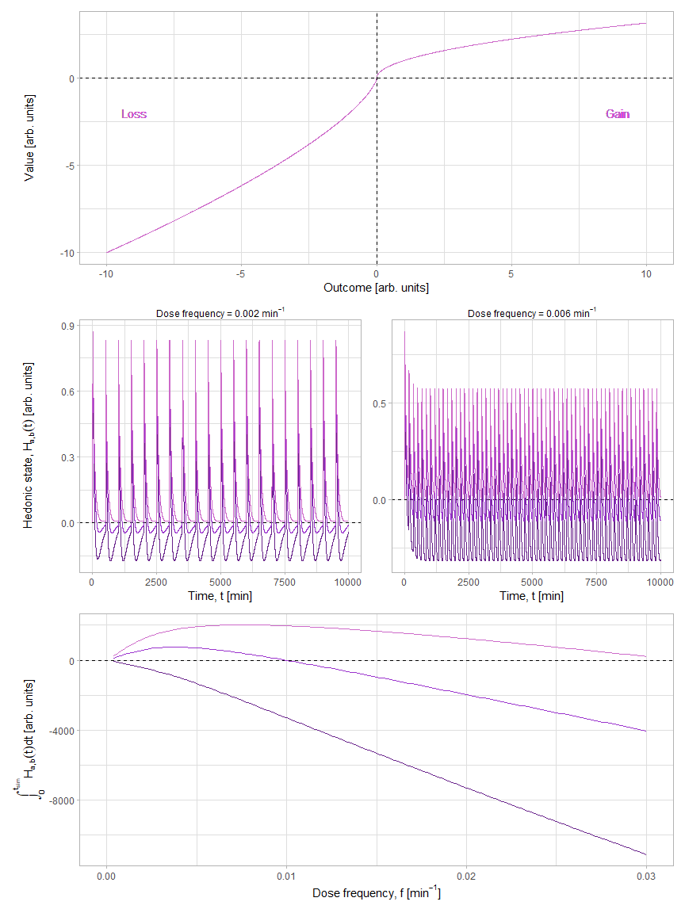

# HALO

#### Nathan Henry, 2023

This package allows you to run behavioral posology simulations using the
HALO paradigm (Hormetic Alignment via Opponent Processes), in order to
simulate the healthy limits of behaviors that have opponent process
dynamics.

The HALO paradigm combines the concepts of allostasis, hormesis,
opponent processes, and prospect theory. For more information, refer to
the paper by Henry et al. (LINK HERE).

## Installation

You can install the HALO package by running the following code in R or
RStudio:

``` r
# Uncomment the line below to install the devtools package if needed
# install.packages('devtools')

# Load devtools package
library(devtools)
```

    Warning: package 'devtools' was built under R version 4.3.1

    Loading required package: usethis

    Warning: package 'usethis' was built under R version 4.3.1

``` r
# Install and load the HALO package from GitHub
install_github('nathhenry3/HALO')
```

    Downloading GitHub repo nathhenry3/HALO@HEAD

    ggplot2   (3.4.2 -> 3.4.3) [CRAN]
    dplyr     (1.1.2 -> 1.1.3) [CRAN]
    patchwork (1.1.2 -> 1.1.3) [CRAN]
    mrgsolve  (1.0.9 -> 1.1.1) [CRAN]

    Installing 4 packages: ggplot2, dplyr, patchwork, mrgsolve

    Installing packages into 'C:/Users/em14031/AppData/Local/R/win-library/4.3'
    (as 'lib' is unspecified)

    package 'ggplot2' successfully unpacked and MD5 sums checked
    package 'dplyr' successfully unpacked and MD5 sums checked
    package 'patchwork' successfully unpacked and MD5 sums checked
    package 'mrgsolve' successfully unpacked and MD5 sums checked

    The downloaded binary packages are in
        C:\Users\em14031\AppData\Local\Temp\RtmpcNyyC3\downloaded_packages
    ── R CMD build ─────────────────────────────────────────────────────────────────
    * checking for file 'C:\Users\em14031\AppData\Local\Temp\RtmpcNyyC3\remotese6743d073f12\nathhenry3-HALO-3e9bc1f/DESCRIPTION' ... OK
    * preparing 'HALO':
    * checking DESCRIPTION meta-information ... OK
    * checking for LF line-endings in source and make files and shell scripts
    * checking for empty or unneeded directories
    * building 'HALO_0.1.0.0.tar.gz'

    Installing package into 'C:/Users/em14031/AppData/Local/R/win-library/4.3'
    (as 'lib' is unspecified)

``` r
library(HALO)
```

## Usage

### Performing a BFRA (Behavioral Frequency Response Analysis)

The HALO paradigm allows you to detect the hormetic (healthy) limits of
behaviors, by performing a Behavioral Frequency Response Analysis (BFRA)
of the opponent processes generated by the behaviors.

A Bode plot allows you to see how changing the frequency of a behavior
leads to different hedonic outcomes. You can create Bode plots using the
bode_plot() function as follows:

``` r
bode_plot()
```


The top graph shows the utility function, which describes the
relationship between the pharmacokinetic values (x-axis) and the
pharmacodynamic effects (y-axis).

The pharmacodynamic effects can be observed in the middle two graphs,
which are simulations of the opponent processes generated by performing
behaviors at different frequencies.

The final graph is the Bode plot, which shows the total hedonic outcome
at each frequency (calculated by taking the integral of the H
compartment over the course of the opponent process simulations). In
this case, performing the behavior at a frequency greater than 0.01
min^(-1) will lead to negative hedonic outcomes.

You can also plot the graphs individually:

``` r
bode_plot(join_plots=FALSE)
```





You can test how varying parameters in the utility function affects the
opponent processes, and in turn affects the hormetic curve. For example,
you can increase the b-process curvature in the utility function:

``` r
bode_plot(gamma_b=c(0.7, 0.9, 1.1))
```


Or increase the magnitude of the loss side of the utility function:

``` r
bode_plot(lambda_b=c(2, 2.5, 3))
```


You can also modify the a-process curvature in the utility function:

``` r
bode_plot(gamma_a=c(0.5, 0.7, 0.9), colorscheme=2)
```


Or increase the magnitude of the gain side of the utility function:

``` r
bode_plot(lambda_b=c(1, 1.5, 2), colorscheme=2)
```


You can modify the pharmacodynamic decay constant for the a-process:

``` r
bode_plot(k_apd=c(0.5, 1, 1.5), colorscheme=3)
```


Or modify the pharmacodynamic decay constant for the b-process:

``` r
bode_plot(k_bpd=c(1.5, 2, 2.5), colorscheme=3)
```



Likewise, you can modify the pharmacokinetic decay constant for the
a-process:

``` r
bode_plot(k_apk=c(0.01, 0.02, 0.03), colorscheme=4)
```


Or modify the pharmacokinetic decay constant for the b-process:

``` r
bode_plot(k_bpk=c(0.01, 0.02, 0.03), colorscheme=4)
```


You can extend the frequency range of the Bode plot:

``` r
bode_plot(multiply=300)
```


You can also cut off behaviors at a certain point, so that they stay
within the hormetic limit:

``` r
bode_plot(addl=40)
```


For more usage examples and detailed explanations, please refer to the
package documentation by using the ‘help()’ function in R.

## License

This package is released under the MIT License, and is free to use and
share.
